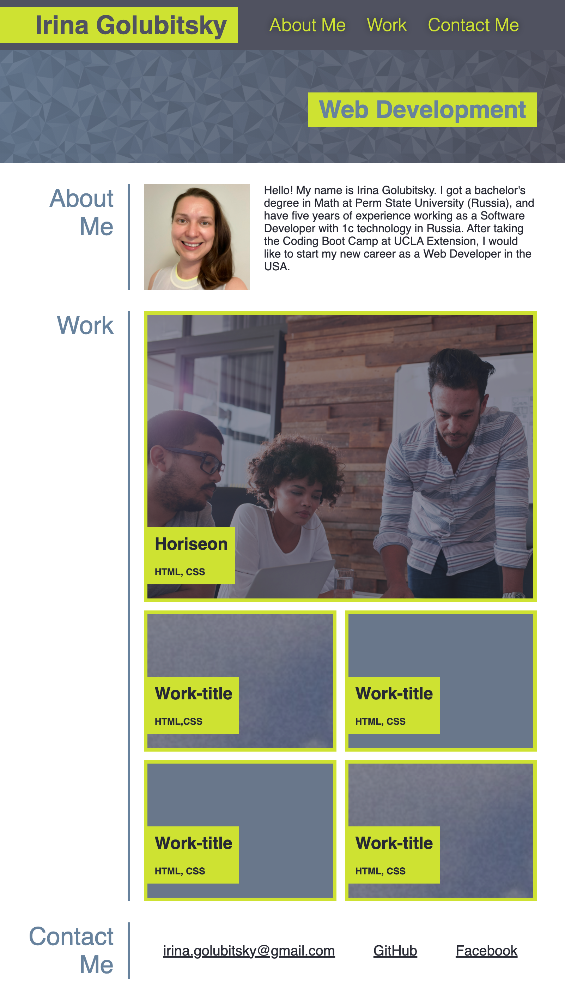
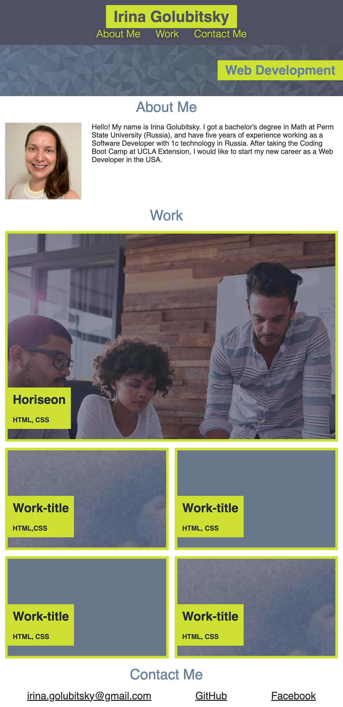

# My Portfolio
​
Deployed portfolio of work samples
​
## Technologies Used

* HTML
* CSS 
## Description 
​
This portfolio website was made using advanced CSS: flexbox, media queries, and CSS variables. It contains information about the developer's name, a recent photo, and links to sections "about me", "work", and "contacts". All Work section links lead to deployed applications. The page view adapts to various screens and devices.

## Usage 
​
To navigave the content you can scroll or use navigation menu at the top left of the page. If you click on the image of the application in the Work section you will be taken to that deployed application.

## Page View

| Page View for a screen resolution of 800px and wider | Page View for a screen resolution of 800px and smaller  |
| :-----: | :-: |
|  | | 

## Link
Link to deployed application https://irina-golubitsky.github.io/Portfolio/

---
MIT License
Copyright (c) [2021] [Irina Golubitsky]
